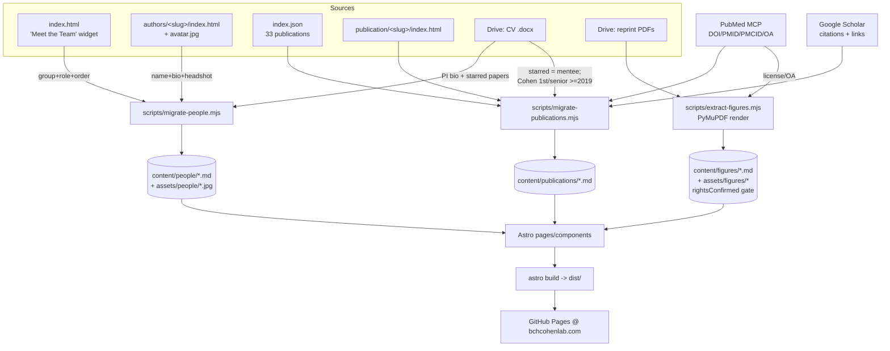

# Rebuild the Cohen Lab Website (Astro + GitHub Pages) — refined

> **Handoff note (2026-06-03):** This is the finalized plan, refined in a cloud session and meant to be
> **implemented locally** in `~/projects/bchcohenlab.github.io` (remote `origin` =
> `bchcohenlab/bchcohenlab.github.io`, default branch **`master`**). It supersedes the earlier plan.
> Implement locally because the migration pulls from Google Drive, PubMed, and Google Scholar — all of
> which were network-blocked (HTTP 403) from the cloud container, and the PubMed/Drive MCP servers are
> only configured on the local machine. To run it: open Claude Code in the repo and say
> "implement REBUILD_PLAN.md".

## Context

The Cohen Laboratory of Translational Neuroimaging (Boston Children's Hospital / Harvard Medical
School, PI **Alexander Li Cohen, MD, PhD**) site at https://bchcohenlab.com is a stale Hugo
"Academic" build. This repo holds only the **compiled output** (no Hugo source), so content must be
recovered from the rendered HTML + `index.json`. We are rebuilding it as a modern, figure-forward
**Astro + Tailwind v4** site on **free GitHub Pages**, keeping the `bchcohenlab.com` apex domain and
dropping the old Netlify/academic-kickstart infra.

This revision supersedes the prior `REBUILD_PLAN.md` with two material changes discovered during
refinement:

1. **The roster is already categorized on the live site.** The homepage `index.html` "Meet the Team"
   widget groups everyone into **Faculty / Researchers / Alumni** (with role + display order). The
   migration reads this directly instead of guessing — Faculty+Researchers = `current`, Alumni =
   `alumni`.
2. **Google Drive + PubMed connectors are available locally** (and required). So CV-sourced bios,
   authoritative publication metadata, and paper figures are **in scope for this PR**, not deferred:
   - CV docx `Cohen_HMS_CV_DB_2026-05-29.docx` (Drive id `1xbxOMlghEZK8U59aJFL2Hmh4x-35-UI8`) → PI bio,
     titles, and the starred (`*`) mentee-authored publications.
   - PubMed MCP → DOI / PMID / PMCID / journal / year / open-access for all publications.
   - **Google Scholar profile** (https://scholar.google.com/citations?user=P9Z-BEcAAAAJ&hl=en) →
     per-paper citation counts + Scholar links.
   - Reprint PDFs folder `2_Article_Reprint_PDFs` (Drive id `1r3dBJZkXJpLXf8p24qSZYN61kVs5cnlM`) →
     figure images, each gated by a `rightsConfirmed` boolean. **Any featured paper whose PDF is not in
     this folder is logged so the PI can drop it in** (no figure rather than a broken build).

### Ground truth verified in this repo (corrects prior counts)
- Branch is **`master`**; the fresh clone has **no remote/tags yet** (created at implementation).
- **37** `authors/<slug>/` dirs. One (`admin`, role "Professor of Artificial Intelligence") is the
  Wowchemy demo placeholder → **drop it**. (No `nelson-bighetti` dir exists.)
- **34** people appear in the team widget; **2** real author dirs do **not** (`a-gholipour` = Ali
  Gholipour, `m-fox` = Michael Fox) — external collaborators, and the only two **without a headshot**.
  Default: **exclude from People pages**, log them; PI may add an "Affiliates" group later.
- **33** `publication/<slug>/` dirs (33 `kind:"page"` objects in `index.json`); avatars are `.jpg`/
  `.jpeg` only.

### Authoritative roster (from the homepage widget → seeds `status`/`group`/`order`)
- **Faculty (current):** a-cohen (Principal Investigator), j-peters (Investigator)
- **Researchers (current):** m-walsh, s-tripathy, s-heras, j-ortega-marquez, s-gampala-sagar, a-castro
- **Alumni:** s-peng, k-nichols, g-miller, c-steeby, j-zhao, z-lu, w-xiao-herman, n-sheikhi,
  a-ovchinnikova, a-imran, b-mulder, c-moschopoulos, e-leikikh, f-yasin, i-zagurly-orly, l-soussand,
  k-warner, m-kroeck, m-fray-witzer, p-brandon-bravo-bruinsma, p-mcmanus, r-mathur, t-hacker, a-edwards,
  j-wall, m-basu

  > Override applied per PI: **s-peng (Shaoling Peng) moved Researchers → Alumni**. Final split = 2
  > Faculty, 6 Researchers, 26 Alumni.

---

## Data flow (migration → content collections → pages)

---

## Implementation

### 1. Preserve the old site (do FIRST)
On `master`, before any change: tag the current compiled site and push a recovery branch so it is
always recoverable.
- `git tag -a old-site-compiled -m "Compiled Hugo site before Astro rebuild"`
- `git branch archive/old-site`
- Do all work on feature branch `rebuild/astro`. Push the tag + `archive/old-site` once a remote is
  present. Never force-push over them.

### 2. Scaffold Astro at repo root
`npm create astro@latest .` (minimal template, strict TS, no sample files) then
`npx astro add tailwind sitemap`.
- `astro.config.mjs`: `site: 'https://bchcohenlab.com'`, **no `base`** (apex Pages serves from root;
  setting `base` would 404 every asset — the #1 footgun).
- `public/CNAME` = `bchcohenlab.com` (re-published every build → keeps the domain bound).
- `public/.nojekyll`.
- Keep the legacy `authors/`, `publication/`, `_site/`, `config/`, `css/`, `js/` dirs untracked-by-Astro
  but present on the branch as the migration source; they get removed from `dist` naturally since Astro
  only emits from `src`/`public`. Delete them from the branch only after migration scripts have run and
  output is validated (they remain in the `archive/old-site` branch + tag).

### 3. Deploy pipeline — `.github/workflows/deploy.yml`
Official path: `withastro/action@v3` (build + upload `./dist`) → `actions/deploy-pages@v4`. Permissions
`pages: write` + `id-token: write`; trigger on push to `master` + `workflow_dispatch`. **One-time manual
cutover step:** repo Settings → Pages → Source = **"GitHub Actions"** (old site used branch deploy).

### 4. Content collections + schemas — `src/content/config.ts`
Four collections via `astro:content` (`z` + `image()` helper). CMS-shaped so Sveltia/Decap can layer on
later with no schema change:
- **`people`** (`type: 'content'`, bio in markdown body): `name`, `status` (`current|alumni`), `group`
  (`Faculty|Researchers|Staff|Students|Affiliates|Alumni`), `role`, `title?`,
  `headshot: image().optional()`, `links { email?, twitter?, scholar?, orcid?, linkedin?, website? }`,
  `order: number`, `featured: boolean`.
- **`publications`**: `title`, `authors: string[]`, `year`, `journal?`, `doi?`, `pmid?`, `pmcid?`,
  `url?`, `scholarUrl?`, `citations?: number`, `isMenteePaper`, `menteeFirstAuthor`,
  `cohenFirstOrSenior` (Cohen is first or last author), `featured`, `openAccess`.
- **`figures`**: `image()`, `paper: reference('publications')`, `caption`, `citation`, `doi?`/`pmid?`,
  `journal?`, `license` (enum: `CC-BY|CC-BY-SA|CC0|publisher-permission|unknown`), `licenseUrl?`,
  **`rightsConfirmed: boolean`** (hard gate), `order`.
- **`gallery`**: `image()`, `caption`, `date`, `people?: string[]`, `featured`.

Enforcement: every figure query filters `rightsConfirmed === true`; People pages partition by `status`
then `group` then `order`. Site singletons (contact/social) in `src/data/site.ts`.

### 5. Migration scripts — `scripts/` (Node ESM; dev-dep `cheerio`)
- **`migrate-people.mjs`**:
  1. Parse the `index.html` "Meet the Team" widget → ordered `{ name, group, role }` list; map
     `group` → `status` (Faculty/Researchers→`current`, Alumni→`alumni`) and assign `order` by widget
     position.
  2. Enumerate `authors/<slug>/index.html`; cheerio-extract display name + full bio; match name →
     widget entry (normalize: strip credentials/punctuation, compare first+last). Slugs **not** in the
     widget (`a-gholipour`, `m-fox`, `admin`) are skipped + logged.
  3. Copy `avatar.{jpg,jpeg}` → `src/assets/people/<slug>.jpg` (glob the extension, log misses).
  4. Emit `src/content/people/<slug>.md` with frontmatter + bio body and
     `headshot: ../../assets/people/<slug>.jpg`. **Reuse old slugs** so inbound `/authors/<slug>` and
     `/people/<slug>` links keep matching.
  5. For **a-cohen only**, enrich bio/title from the CV docx (Drive `read_file_content` on id
     `1xbxOMlghEZK8U59aJFL2Hmh4x-35-UI8`) — current appointment line "Assistant Professor of Neurology,
     Harvard Medical School; Director, DoCS, BCH".
- **`migrate-publications.mjs`**:
  1. From `index.json` (`kind:"page"`) read title/authors/year/permalink; reuse slug from
     `relpermalink`.
  2. Resolve each via **PubMed MCP** (`lookup_article_by_citation` first; fall back to
     `search_articles` by title+author+year) → DOI, PMID, PMCID, journal, canonical authors. Set
     `openAccess: true` when a PMCID exists or `get_copyright_status` reports a CC license.
  3. Enrich with **Google Scholar** (profile `user=P9Z-BEcAAAAJ`): fetch the profile's publication list
     (WebFetch; expand citation count + per-paper link), match to records by normalized title → set
     `citations` and `scholarUrl`. Scholar has no API and may rate-limit → on failure leave both fields
     unset and log; never block the build.
  4. **Featured / highlight logic** — set `featured: true` when **either**:
     - the paper is a **mentee first-author** paper (from CV stars `*` + first author is a lab member),
       e.g. Miller 2025, Steeby 2026, Tripathy 2025, Peng 2024 ×2, Jiang 2023, Kletenik 2023, Wall
       2025, Herman 2025, Zagury-Orly 2021; **or**
     - **Cohen is first or senior (last) author** and `year >= 2019` → set `cohenFirstOrSenior: true`.
     Also set `isMenteePaper`/`menteeFirstAuthor` from the CV stars. Log any CV title not matched (2026
     papers may post-date `index.json` → add by hand).
  5. Emit `src/content/publications/<slug>.md`.
- **`extract-figures.mjs`** (dev-dep: PyMuPDF via a small Python helper, or `pdfimages`/`pdftoppm` from
  poppler — whichever is present; prefer **PyMuPDF** `page.get_pixmap()` for a clean full-figure render):
  1. List the reprint PDF folder (Drive id `1r3dBJZkXJpLXf8p24qSZYN61kVs5cnlM`); match featured papers
     by author-year filename.
  2. `download_file_content` (base64) → write PDF to a temp path → render the chosen figure page to PNG
     → save `src/assets/figures/<slug>-fig1.png`.
  3. Emit `src/content/figures/<slug>.md` referencing the publication, with `license`/`licenseUrl` from
     the PubMed copyright check. **`rightsConfirmed: true` only** for confirmed CC-BY venues (Imaging
     Neuroscience, Brain Communications, Communications Biology, Annals of CNS); **`false`** for
     subscription journals (Biological Psychiatry, J Neurology) until permission is documented.

### 6. Pages & components
- **Pages (`src/pages/`):** `index.astro` (hero w/ brain motif + mission + featured-figures strip +
  latest group photo), `people/index.astro` (Faculty → Researchers → Alumni), `people/[slug].astro`
  (`getStaticPaths`), `research.astro`, `publications.astro` (client-filterable; mentee + Cohen-authored
  badges; shows citation count + Scholar link when present), `figures.astro` (rights-gated gallery),
  `lab-life.astro` (dated photo grid from `gallery`), `contact.astro` (email/phone/Brookline Place
  address + map embed), `404.astro`.
  - **Participate-in-research is retired** (studies closed): do **not** build `participate/` pages or a
    nav entry. The old `participate/k23.html` + `participate/neurofeedback.html` survive only in the
    `archive/old-site` branch + tag.
  - **`research.astro` is regenerated** around three current themes (drop the old "Projects" widget
    copy): **(1) Lesion Network Mapping** — TSC and perinatal stroke; **(2) ADHD** — pharmaco-fMRI and
    neurofeedback; **(3) Methods development**. One section each (heading + short description + linked
    featured publications/figures); ADHD section may note the neurofeedback work without a participation
    CTA.
- **Components (`src/components/`):** `BaseLayout`, `ProfileLayout`, `Nav`, `Footer`, `SEO`, `Hero`,
  `SectionHeading`, `PersonCard` (initials placeholder when `headshot` absent), `PersonGroup`,
  `PubItem`/`PubList` (renders mentee/Cohen-author badge + citations + Scholar/DOI links),
  `FigureCard` (caption + citation + license badge + DOI), `GalleryGrid`.
- All raster images via `astro:assets` `<Image>` (responsive WebP, lazy, alt text everywhere).

### 7. Styling
Tailwind v4 **CSS-first** `@theme` in `src/styles/global.css`: ocean-blue primary + brain-motif pink
accents (from the old brand), serif headings (Newsreader) + Inter body via `@fontsource`, `max-w-6xl`
container, generous whitespace, AA contrast. Light-first; dark-mode tokens stubbed, not gating launch.
**Tailwind v4 (Vite plugin + `@theme`), not v3** — ignore `tailwind.config.js`/PostCSS tutorials.

---

## Build order (verify at each step)
1. Preserve old site (tag + `archive/old-site` branch) — `git tag` / `git branch` confirm.
2. Branch `rebuild/astro` + scaffold + tailwind/sitemap — `npm run dev` serves starter.
3. Config + `public/CNAME`/`.nojekyll` + BaseLayout/Nav/Footer/global.css — internal links resolve at root.
4. Schemas (`content/config.ts`) — `npx astro check` passes empty.
5. Run `migrate-people.mjs` → 34 people `.md` + headshots (2 missing → initials placeholder; admin/
   gholipour/fox skipped & logged); `migrate-publications.mjs` → 33 pubs w/ PubMed metadata;
   `extract-figures.mjs` → featured figures. `astro check` validates all frontmatter.
6. People pages → every profile route builds; Faculty/Researchers/Alumni split matches the roster above.
7. Publications page → filter works; mentee + Cohen-first/senior (≥2019) papers flagged; citation
   counts + Scholar/DOI links render where resolved.
8. Figures → flip one `rightsConfirmed` false↔true and confirm show/hide; subscription-journal figures absent.
9. Lab Life, Research (3 themes), Contact, Home hero, 404. (No Participate page.)
10. `npm run build && npm run preview` → `dist/CNAME` contains `bchcohenlab.com`, sitemap present,
    preview serves at root (apex parity), no broken links.
11. **Cutover:** open PR `rebuild/astro` → `master`; after merge set Pages Source = "GitHub Actions";
    push triggers deploy. `curl -I https://bchcohenlab.com` → 200 (not a github.io redirect), HTTPS on.
    DNS unchanged (apex records already point at Pages).
12. PI refines roster/figures over time (one field per person; flip `rightsConfirmed` as permissions land).

## Risks / edge cases
- **`base` path:** keep `/` for apex Pages; never set to repo name. `astro preview` is the truth.
- **CNAME loss** silently unbinds the domain → `public/CNAME` + leave Pages "Custom domain" populated; verify post-deploy.
- **Name→slug matching** in `migrate-people` (credentials, "Xiao Herman", "Zagurly-Orly" vs slug
  `i-zagurly-orly`) → match on normalized first+last, log every unmatched widget entry and every
  unmatched author dir so nothing is silently dropped.
- **Figure copyright** → default `rightsConfirmed:false`; gate enforced at query time so half-filled
  records can't leak. Only auto-confirm verified CC-BY venues.
- **PDF figure extraction** depends on PyMuPDF/poppler in the container → if neither installs, fall back
  to emitting figure records with `rightsConfirmed:false` and no image (PI supplies images later);
  build must not break.
- **Old `/publication/<slug>/` & `/authors/<slug>/` inbound links** → slugs reused; optionally add thin
  redirect pages (GitHub Pages ignores `_redirects`).
- **Rollback:** `git checkout old-site-compiled` → `master`; Pages source back to branch deploy.

## Later (NOT built now)
Member self-service: Sveltia/Decap CMS at `/admin` (the `type:'content'` people model already maps to
CMS widgets), GitHub OAuth via a free Cloudflare Worker, members on a GitHub team with write access. No
schema/content changes required.

## Verification (end-to-end)
- Local: `npm run dev`; `npm run build && npm run preview`; `npx astro check` clean; spot-check every page.
- `dist/CNAME` present & correct; sitemap generated; figures with `rightsConfirmed:false` absent from output.
- Roster: People page shows 2 Faculty, 6 Researchers, 26 Alumni in widget order (s-peng under Alumni);
  a-cohen bio reflects CV.
- No `participate/` route exists; `research.astro` shows the three themes (LNM, ADHD, Methods).
- Post-deploy: Actions green; `https://bchcohenlab.com` serves the new site over HTTPS with domain bound;
  old site recoverable from `old-site-compiled` tag / `archive/old-site` branch.
